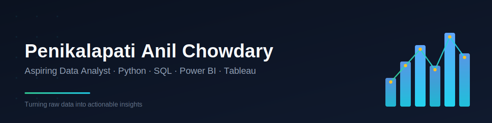

# Hello! Welcome to my Portfolio 

---

## 📌 About Me

Hi there! I'm **Penikalapati Anil Chowdary**, a final-year B.Tech CSE student and aspiring Data Analyst passionate about transforming raw data into actionable business insights. I specialize in leveraging Python, SQL, Excel, and Power BI/Tableau to drive informed decision-making and unlock hidden patterns in complex datasets.

### 🔍 Key Strengths
- **Data Cleaning & EDA** – Prepare and explore data for meaningful analysis
- **Statistical Analysis** – Apply statistical methods to extract insights
- **Dashboard Development** – Create interactive, user-friendly dashboards
- **KPI Development** – Design and track key performance indicators
- **Data Storytelling** – Communicate data insights through compelling narratives

### 💻 Tools & Technologies

**Programming:** Python, SQL, Java

**Visualization:** Power BI, Tableau, Matplotlib, Seaborn

**Databases:** MySQL

**Others:** Excel, Pandas, NumPy

---

## 📊 Featured Projects

### 🚇 Hyderabad Metro Analytics Dashboard
**Objective:** Analyze passenger traffic, revenue trends, and station performance using 5,000+ Hyderabad Metro records.

**Skills Demonstrated:** DAX, KPI development, peak-hour and route analysis

**Tools Used:** Power BI, Excel

**Key Insights:** Built KPIs for Total Passengers, Revenue, Daily Ridership, Smart Card Usage; identified high-traffic periods and routes.

📁 **View Project:** [Link]

---

### 📈 Sales Performance Dashboard & Analytics
**Objective:** Analyze 5,000+ sales records to track revenue trends and regional performance.

**Skills Demonstrated:** Data cleaning, SQL querying, dashboard design

**Tools Used:** Excel, SQL

**Key Insights:** Identified top-performing products and improved sales monitoring through interactive reports.

📁 **View Project:** [Link]

---

## 🌐 Let's Connect!

I'd love to connect with you and discuss data-driven solutions, analytics opportunities, or collaboration! Feel free to reach out through any of these channels:

- 📧 **Email:** anilc3448@gmail.com
- 🔗 **LinkedIn:** https://in.linkedin.com/in/penikalapati-anil-chowdary-8543a72a6
- 💼 **Portfolio Website:** https://anilchowdary.lovable.app
- 📦 **GitHub:** https://github.com/AnilChowdary98

---

## 📢 Final Words

Thank you for visiting my GitHub profile! I'm constantly learning, exploring new tools, and working on exciting data projects. If you find any of my work interesting or would like to collaborate, don't hesitate to reach out. Let's turn data into insights together! 🚀
